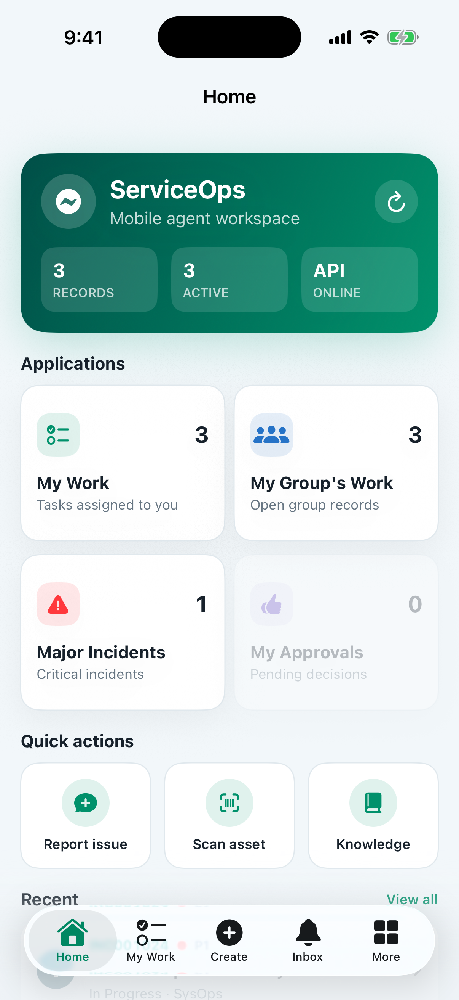
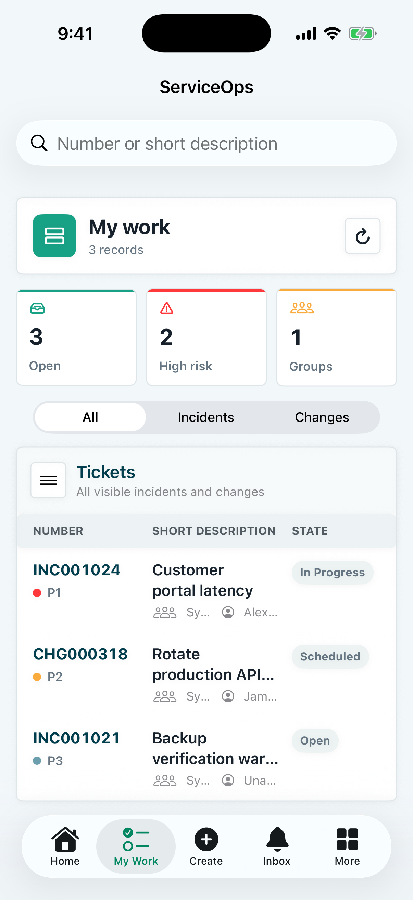
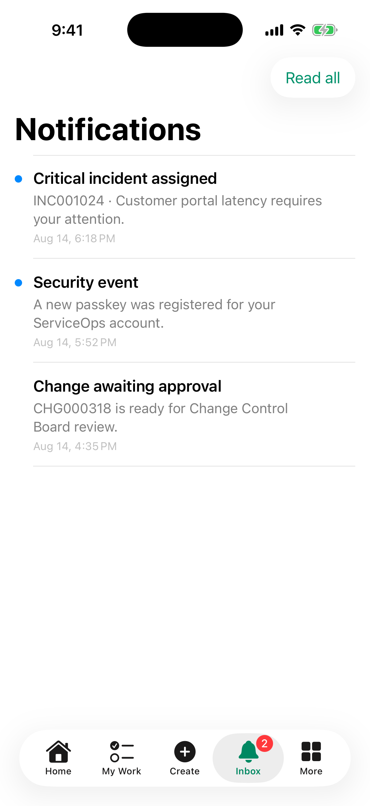
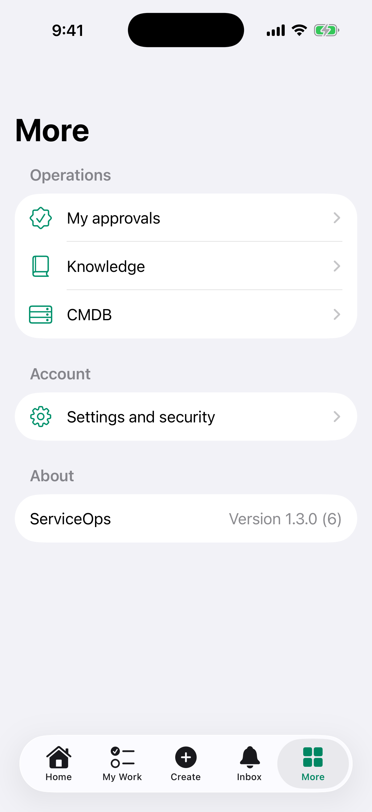

# ServiceOps for iOS

Native iPhone workspace for the self-hosted
[ServiceOps](https://github.com/awijesundara/ServiceOps) platform. The app uses
the signed-in user's ServiceOps identity; it does not embed or share a static
API key.

Current app version: **1.3.0 (build 6)**

## Screenshots

<table>
<tr><td width="50%"> Home and operational overview</td><td width="50%"> Assigned incidents and changes</td></tr>
<tr><td width="50%"> Ticket, approval, and security notifications</td><td width="50%"> Approvals, knowledge, CMDB, security, and app version</td></tr>
</table>

## Included capabilities

- Local or LDAP user authentication with MFA and rotating access/refresh tokens.
- Face ID or Touch ID foreground lock and Keychain-protected session storage.
- Passkey registration and passwordless sign-in.
- Home dashboard, assigned incidents and changes, record search and filtering.
- Incident creation, record updates, work notes, and activity history.
- Approval actions, knowledge search, CMDB lookup, and connection diagnostics.
- APNs device registration, real-time ticket/approval/security alerts, and an
  in-app notification inbox.
- User-attributed server audit events containing iOS platform, app version,
  build, and device context.

## Run locally

1. Open `ServiceOps.xcodeproj` in Xcode and select the `ServiceOps` target.
2. Under **Signing & Capabilities**, select your Apple development team.
3. Run on a simulator or a signed iPhone.
4. Enter the HTTPS ServiceOps URL and sign in with your own account.

For local development, the default server is `http://192.168.68.65`. A
physical iPhone must be on the same LAN and use the Mac's LAN address;
`127.0.0.1` points to the phone itself. Plain HTTP is intended only for the
local development subnet. Use HTTPS outside that environment.

Push notifications require a signed build with the Push Notifications
entitlement and matching APNs configuration in ServiceOps:

- Team ID
- APNs key ID
- complete `.p8` private key
- bundle identifier `wijesundara.com.ServiceOps`
- sandbox or production APNs environment matching the installed build

Never commit signing keys, provisioning profiles, credentials, tokens, or
local device inventories. The repository `.gitignore` excludes these files.

## Screenshot maintenance

Repository images were captured from the real iPhone simulator build with
non-sensitive fixture records. The temporary capture fixture was removed after
capture, so no demo-data or authentication-bypass path ships in source.
