# ServiceOps for iOS

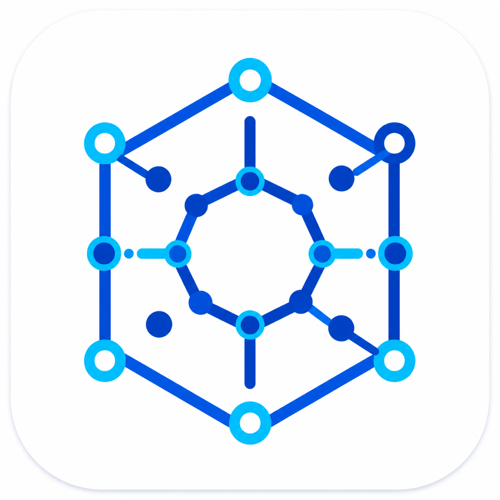

[](https://github.com/awijesundara/ServiceOps_iOS/actions/workflows/ci.yml)
[](https://github.com/awijesundara/ServiceOps_iOS/commits/main)
[](https://github.com/awijesundara/ServiceOps_iOS)
[](https://github.com/awijesundara/ServiceOps_iOS)
[](#)
[](ServiceOps)
[](ServiceOps.xcodeproj)
[](https://github.com/awijesundara/ServiceOps)

Native iPhone workspace for the self-hosted
[ServiceOps](https://github.com/awijesundara/ServiceOps) platform. The app uses
the signed-in user's ServiceOps identity; it does not embed or share a static
API key.

Current app version: **1.3.2 (build 8)**

## Screenshots

The current simulator captures use non-sensitive example records. Optional rack totals depend on the server response.

### Everyday work

<table>
<tr><td width="50%">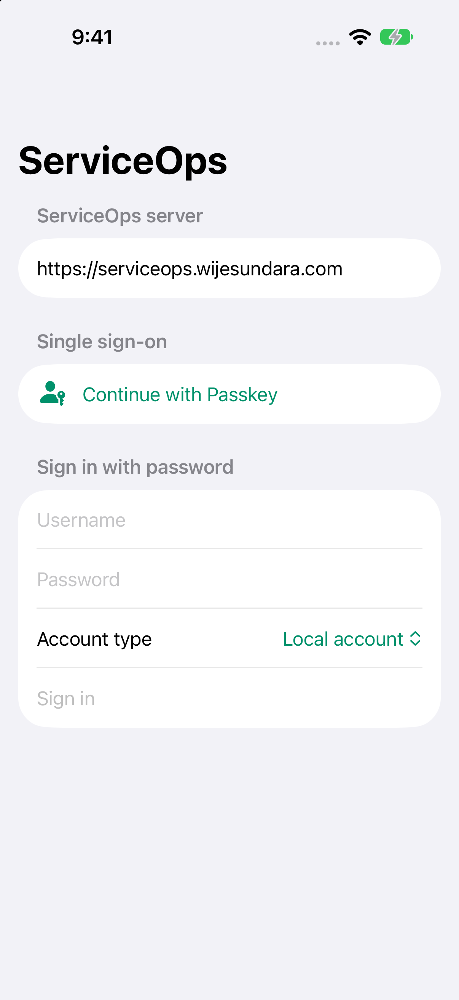<br><sub>Server-aware sign-in</sub></td><td width="50%">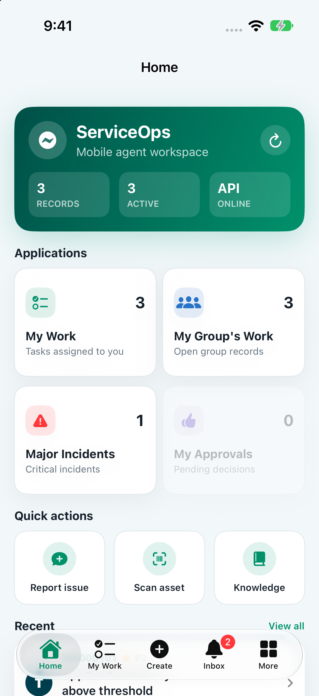<br><sub>Home overview and quick actions</sub></td></tr>
<tr><td width="50%">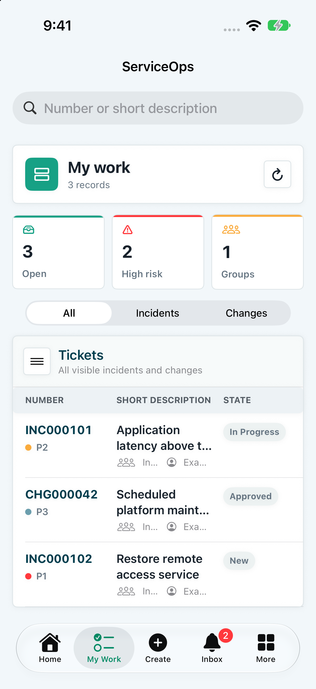<br><sub>My Work: incidents and changes</sub></td><td width="50%">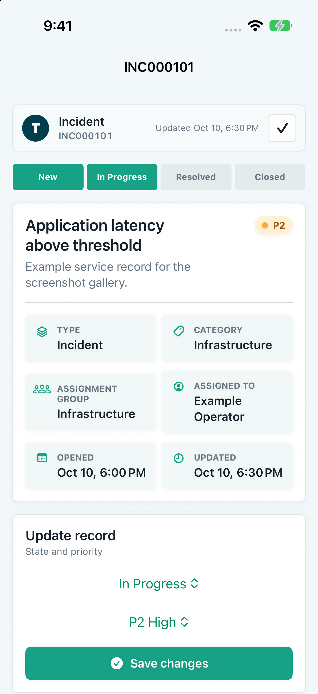<br><sub>Record details and status updates</sub></td></tr>
<tr><td width="50%">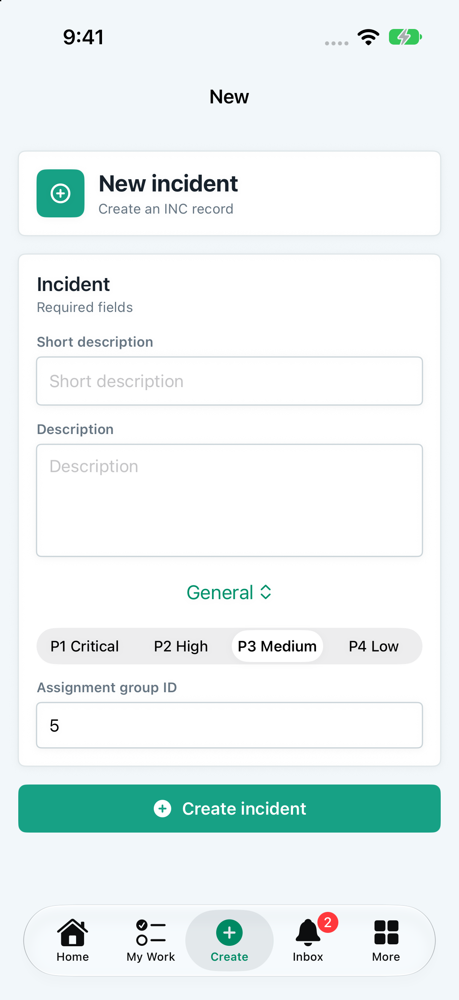<br><sub>Create an incident</sub></td><td width="50%">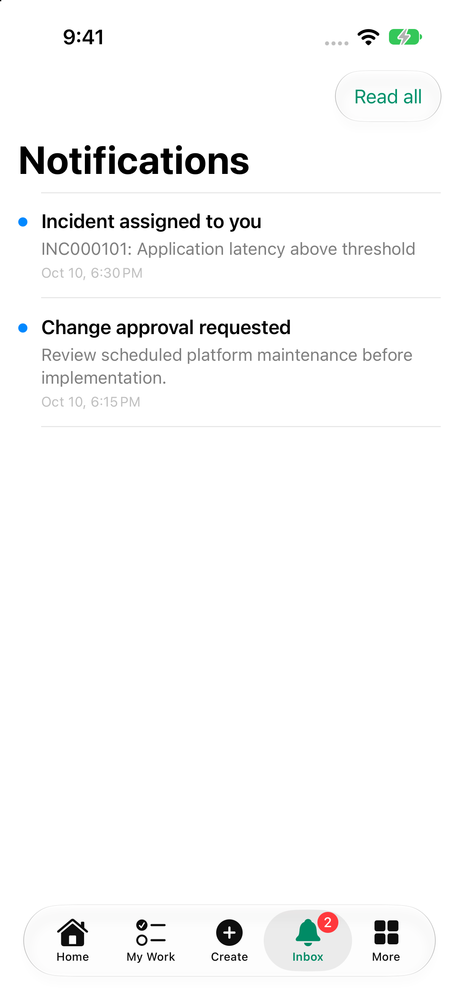<br><sub>Ticket and approval notifications</sub></td></tr>
</table>

### Reference, infrastructure and connection

<table>
<tr><td width="50%">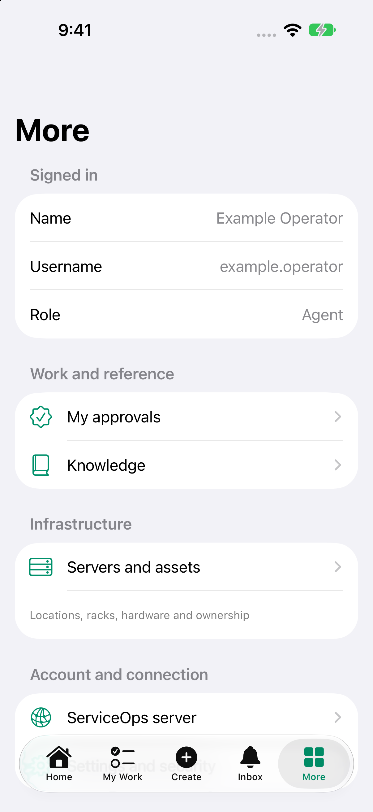<br><sub>More: work, infrastructure and account</sub></td><td width="50%">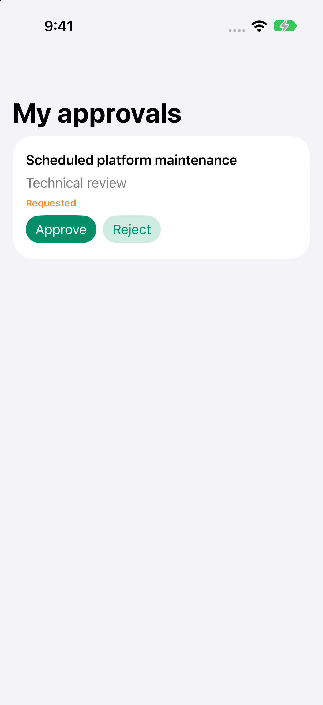<br><sub>Review and decide approvals</sub></td></tr>
<tr><td width="50%">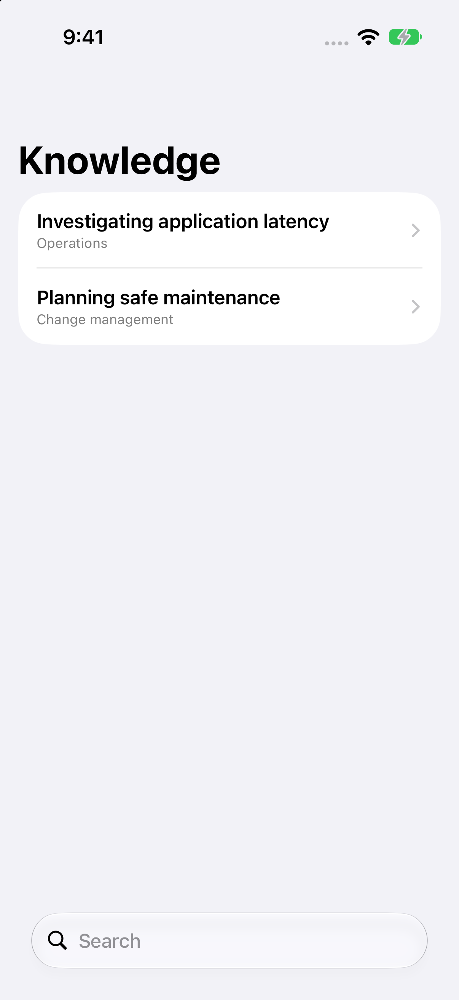<br><sub>Search operational knowledge</sub></td><td width="50%">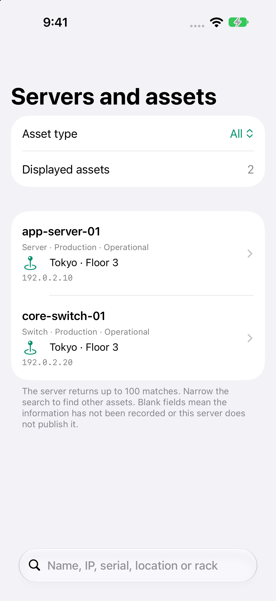<br><sub>CMDB: servers and assets</sub></td></tr>
<tr><td width="50%">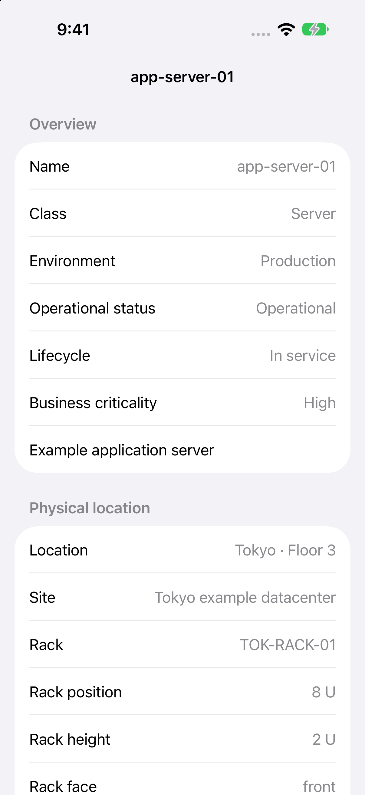<br><sub>Physical location, hardware and ownership</sub></td><td width="50%">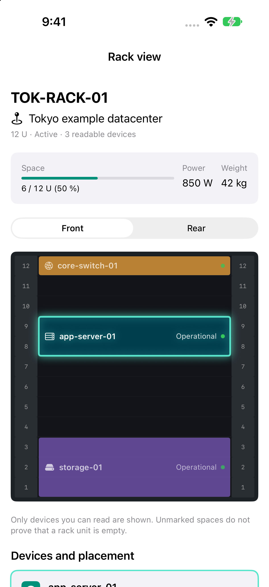<br><sub>Front/rear rack layout and selected server</sub></td></tr>
<tr><td width="50%">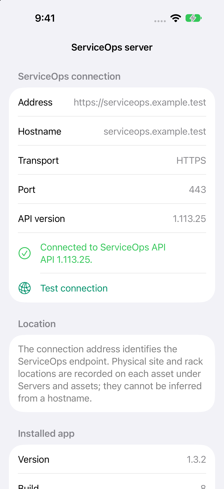<br><sub>Endpoint, transport and API diagnostics</sub></td><td></td></tr>
</table>

## Included capabilities

- Local or LDAP user authentication with MFA and rotating access/refresh tokens.
- Face ID or Touch ID foreground lock and Keychain-protected session storage.
- Passkey registration and passwordless sign-in.
- Home dashboard, assigned incidents and changes, record search and filtering.
- Incident creation, record updates, work notes, and activity history.
- Approval actions, knowledge search, searchable assets with site/rack/hardware details, and connection diagnostics.
- Front/rear rack elevations with selected-device highlighting, recorded capacity, placement warnings and optional server-provided totals.
- APNs device registration, real-time ticket/approval/security alerts, and an
  in-app notification inbox.
- User-attributed server audit events containing iOS platform, app version,
  build, and device context.

## Run locally

1. Open `ServiceOps.xcodeproj` in Xcode and select the `ServiceOps` target.
2. Under **Signing & Capabilities**, select your Apple development team.
3. Run on a simulator or a signed iPhone.
4. Enter the HTTPS ServiceOps URL and sign in with your own account.

New installations default to `https://serviceops.wijesundara.com`. Existing saved server addresses are preserved. Enter your own HTTPS ServiceOps endpoint when connecting to another deployment. Local HTTP is for development only; `127.0.0.1` on a physical phone refers to the phone itself.

### Passkeys and signing

Simulator builds retain an application identifier and Associated Domains entitlement. Debug simulator builds also include the Associated Domains developer-mode entry. The `apple-app-site-association` document must be publicly reachable and list your team ID plus bundle identifier.

The current device entitlement file supports builds using a personal development team and omits Associated Domains; **passkeys are unavailable in that device configuration**. For a team provisioned for Associated Domains, set `CODE_SIGN_ENTITLEMENTS[sdk=iphoneos*]` to `ServiceOps/ServiceOps.entitlements` in both Debug and Release and use a matching provisioning profile. Push notifications likewise need a profile with the relevant capability.

Native passkey creation and physical-device acceptance remain to be verified. Simulator build and screenshot checks do not establish either.

Push notifications require a signed build with the Push Notifications
entitlement and matching APNs configuration in ServiceOps:

- Team ID
- APNs key ID
- complete `.p8` private key
- bundle identifier `wijesundara.com.ServiceOps`
- sandbox or production APNs environment matching the installed build

Never commit signing keys, provisioning profiles, credentials, tokens, or
local device inventories. The repository `.gitignore` excludes these files.

## Screenshot maintenance

Repository images were captured from the real iPhone simulator build with
non-sensitive fixture records. The temporary capture fixture was removed after
capture, so no demo-data or authentication-bypass path ships in source.

## Validation

CI builds the iOS simulator target and runs rack layout and backward-compatible response decoding regressions. Run the same model checks locally:

```sh
xcrun swiftc ServiceOps/Models.swift ServiceOps/RackLayout.swift Tests/main.swift -o /tmp/serviceops-model-checks
/tmp/serviceops-model-checks
```

Screenshot capture uses a separate temporary build with example network responses. No fixture data, capture entrypoint or authentication bypass is included in the published app source.
